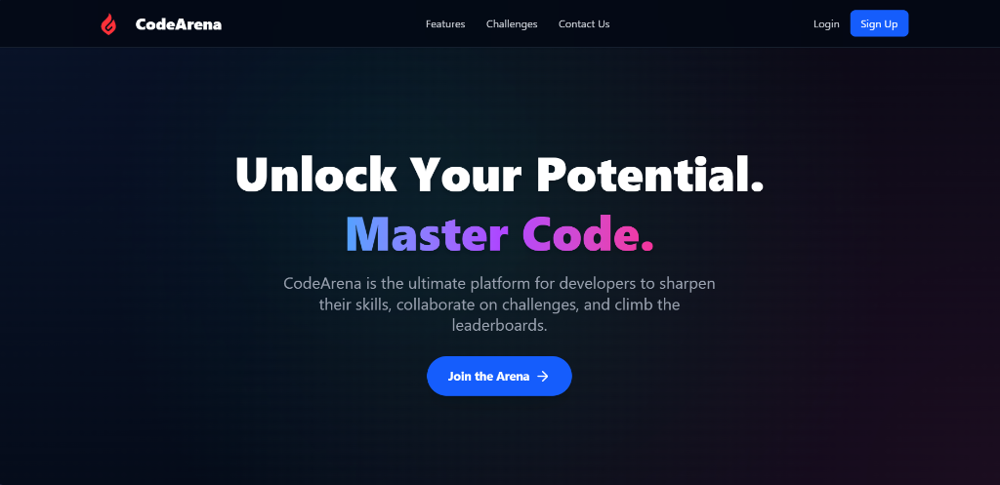

# CodeArena - Advanced Coding Platform

[](https://opensource.org/licenses/MIT)
[](https://nodejs.org/)
[](https://reactjs.org/)
[](https://www.mongodb.com/)



> **A Next-Generation Competitive Programming Platform integrated with AI assistance.**

**CodeArena** is a comprehensive coding platform designed to help developers practice data structures and algorithms. It features a robust code editor, multi-language support, real-time code execution, and a unique **AI Coding Assistant** powered by Google GenAI to help users learn and debug efficiently.

---

## 🌟 Key Features

### 💻 **Advanced Code Editor**
*   **Monaco Editor Integration:** a rich code editing experience similar to VS Code.
*   **Multi-Language Support:** Write and run code in **C++, Java, Python, and JavaScript**.
*   **Syntax Highlighting:** Intelligent syntax highlighting and auto-formatting.

### 🤖 **AI-Powered Assistance**
*   **Integrated AI Chat:** A built-in AI assistant (powered by **Google GenAI**) to help with:
    *   **Debugging:** Explain why your code is failing.
    *   **Concept Explanation:** Break down complex algorithms.
    *   **Hints:** Get nudges in the right direction without revealing the full solution.

### ⚡ **Real-Time Execution & Submission**
*   **Instant Feedback:** Run your code against sample test cases with immediate output.
*   **Comprehensive Judging:** Submit solutions to be tested against hidden test cases.
*   **Performance Metrics:** specific runtime and memory usage statistics for every submission.
*   **Verdict System:** Clear status indicators for Accepted, Wrong Answer, Runtime Error, etc.

### 📚 **Learning Resources**
*   **Problem Collection:** A curated list of DSA problems with varying difficulty levels (Easy, Medium, Hard).
*   **Editorials & Solutions:** Access official editorials and reference solutions in multiple languages.
*   **Video Explanations:** Watch detailed video walkthroughs for complex problems.

### 👤 **User & Admin Portals**
*   **User Dashboard:** Track your solved problems and submission history.
*   **Admin Panel:** Powerful tools for admins to **Create, Update, and Delete** problems.
*   **Authentication:** Secure Login and Signup using JWT and specialized middleware.

---

## 🛠️ Tech Stack

This project is built using a modern **MERN** stack with additional specialized services:

### **Frontend**
*   **Framework:** React 19 (Vite)
*   **State Management:** Redux Toolkit
*   **Styling:** Tailwind CSS v4, DaisyUI
*   **Code Editor:** @monaco-editor/react
*   **Routing:** React Router v7
*   **Animations:** Framer Motion
*   **Validation:** Zod + React Hook Form

### **Backend**
*   **Runtime:** Node.js
*   **Framework:** Express.js v5
*   **Database:** MongoDB (Mongoose)
*   **Caching:** Redis (for session/performance)
*   **AI Engine:** @google/genai (Gemini API)
*   **Authentication:** JWT, bcrypt
*   **Media Storage:** Cloudinary
*   **Real-time:** Socket.io (for live features)

---

## 🏁 Getting Started

### Quick Start

For detailed setup instructions, see [SETUP.md](SETUP.md)

```bash
# Clone the repository
git clone https://github.com/Aman-81/CodeArena.git
cd CodeArena

# Setup backend
cd backend
npm install
cp src/.env.example src/.env
# Edit src/.env with your credentials
npm start

# Setup frontend (in a new terminal)
cd frontend
npm install
cp .env.example .env
npm run dev
```

### Prerequisites
*   Node.js (v18+)
*   MongoDB (Local or Atlas)
*   Redis instance
*   API Keys: Judge0, Google Gemini, Cloudinary

See [SETUP.md](SETUP.md) for detailed instructions on obtaining API keys and configuration.

---


## 🤝 Contributing

We welcome contributions! Please see [CONTRIBUTING.md](CONTRIBUTING.md) for detailed guidelines.

**Quick steps:**
1.  Fork the Project
2.  Create your Feature Branch (`git checkout -b feature/AmazingFeature`)
3.  Commit your Changes (`git commit -m 'Add some AmazingFeature'`)
4.  Push to the Branch (`git push origin feature/AmazingFeature`)
5.  Open a Pull Request

---

## 👑 Creator

**Aman Savita**

*   **Role:** Project Creator & Lead Developer
*   **Vision:** Democratizing coding education through AI-driven tools.

---

## 📝 License

Distributed under the MIT License. See [LICENSE](LICENSE) for more information.

## 🙏 Acknowledgments

- [Judge0](https://judge0.com/) - Code execution engine
- [Google Gemini](https://deepmind.google/technologies/gemini/) - AI assistance
- [MongoDB](https://www.mongodb.com/) - Database
- [Redis](https://redis.io/) - Caching layer
- [Cloudinary](https://cloudinary.com/) - Media storage

## 📞 Contact

**Aman** - Project Creator & Lead Developer

Project Link: [https://github.com/Aman-81/CodeArena](https://github.com/Aman-81/CodeArena)
